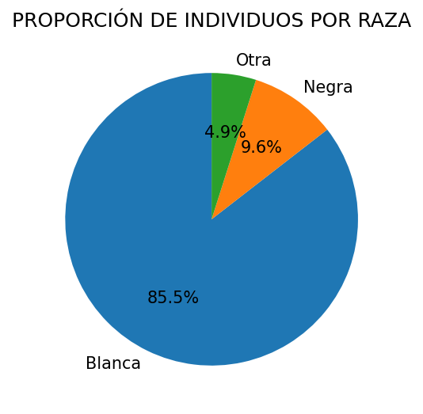
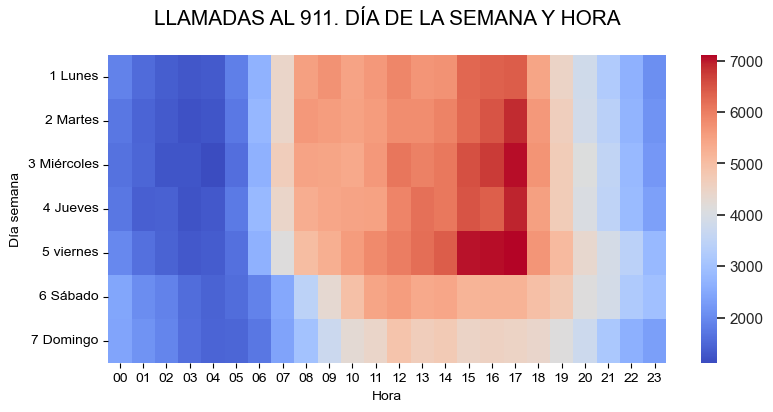
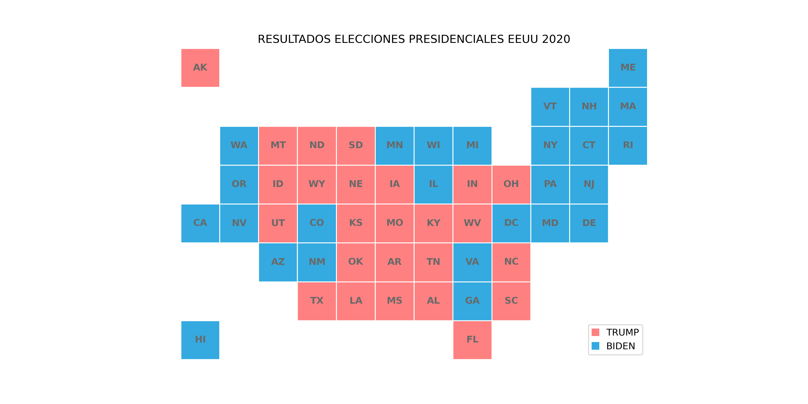

# PEC2: Estudio de técnicas de visualización de datos
## Visualización de Datos
## Master Universitario en Ciencia de Datos
### Alumno: Carlos Luis Gento de Celis

# Índice
1. [Pie Chart](#pie-chart)
2. [Matrix Plot](#matrix-plot)
3. [Tile Grid Map](#tile-grid-map)

## Pie Chart
- **Descripción:** Es un círculo dividido en sectores proporcionales que representan una proporción de un total. Su objetivo es mostrar cómo se dividen los datos en proporciones o porcentajes entre categorías. La suma de proporciones debe ser igual al total de la muestra, y la de porcentajes debe ser igual al 100%.
- **Ejemplos:** Proporción de individios para cada nivel educativo en una muestra, porcentaje de ventas mensuales de cada producto en una tienda, distribución del valor de cada tipo de activo financiero (acciones, fondos de inversión, renta foja...) en la riqueza financiera de un hogar.
- **Tipos de datos:** Numéricos y categóricos. Debe haber al menos una variable categórica.
- **Ejemplo de estructura de datos**: Número de individuos para cada nivel educativo

  <table class="tg">
  <thead>
    <tr>
      <th class="tg-0pky">Nivel educativo</th>
      <th class="tg-c3ow">Personas</th>
    </tr>
  </thead>
  <tbody>
    <tr>
      <td class="tg-0pky">Inferior a Bachillerato</td>
      <td class="tg-c3ow">150</td>
    </tr>
    <tr>
      <td class="tg-0pky">Bachillerato</td>
      <td class="tg-c3ow">500</td>
    </tr>
    <tr>
      <td class="tg-0pky">Estudios Universitarios</td>
      <td class="tg-c3ow">250</td>
    </tr>
  </tbody>
  </table>

  
- **Limitaciones:**
   * Cuesta leerlos cuando hay más de cuatro o cinco categorías. A los humanos les cuesta leer ángulos.
   * No pueden representar evoluciones temporales.

- **Ejemplo de visualización: Distribución de adultos por raza**
 * Datos utilizados: [Kaggle Adult Income Dataset](https://www.kaggle.com/datasets/wenruliu/adult-income-dataset)
 * El 85.5% de los individuos de la muesta son de raza blanca. La siguiente con mayor representación es la negra, con el 9.6%. El resto de razas representan el 4.9% de la muestra.
 

 

  
 

## Matrix Plot
- **Descripción:** Tipo de gráfico que permite visualizar datos que puedan representarse en formato de matriz. Las filas y columnas de la matriz generalmente representan dos variables categóricas, y cada celda representa el valor para ese punto de la matriz. Permiten ver patrones y correlaciones entre variables, o incluso cómo cambian los valores de una categoría a lo largo del tiempo. Un ejemplo es el mapa de calor, en el que las diferencias en los valores se presentan a través de variaciones en los colores de las celdas.
- **Ejemplos:** Matrices de correlaciones, matrices de distacias, porcentaje de personas para cada nivel de estudios a lo largo de las décadas.
- **Tipos de datos:** Numéricas y categóricas. Tienen que poder representarse en formato de matriz.
- **Ejemplo de estructura de datos**: Evolución temporal del porcentaje de población para cada nivel educativo

  <table class="tg">
  <thead>
    <tr>
      <th class="tg-0pky"></th>
      <th class="tg-c3ow">1970</th>
      <th class="tg-0lax">1980</th>
      <th class="tg-0lax">1990</th>
      <th class="tg-0lax">2000</th>
      <th class="tg-0lax">2010</th>
      <th class="tg-0lax">2020</th>
    </tr>
  </thead>
  <tbody>
    <tr>
      <td class="tg-0pky">Inferior a Bachillerato</td>
      <td class="tg-c3ow">50%</td>
      <td class="tg-0lax">45%</td>
      <td class="tg-0lax">40%</td>
      <td class="tg-0lax">35%</td>
      <td class="tg-0lax">30%</td>
      <td class="tg-0lax">25%</td>
    </tr>
    <tr>
      <td class="tg-0pky">Bachillerato</td>
      <td class="tg-c3ow">45%</td>
      <td class="tg-0lax">45%</td>
      <td class="tg-0lax">50%</td>
      <td class="tg-0lax">50%</td>
      <td class="tg-0lax">45%</td>
      <td class="tg-0lax">40%</td>
    </tr>
    <tr>
      <td class="tg-0pky">Estudios Universitarios</td>
      <td class="tg-c3ow">5%</td>
      <td class="tg-0lax">10%</td>
      <td class="tg-0lax">10%</td>
      <td class="tg-0lax">15%</td>
      <td class="tg-0lax">25%</td>
      <td class="tg-0lax">35%</td>
    </tr>
  </tbody>
  </table> 

 
- **Limitaciones:**
   * Muchas veces es necesario hacer un tratamiento previo de los datos.
   * Es importante seleccionar una buena paleta de colores. Los colores deben contrastar.

- **Ejemplo de visualización: Mapa de calor, llamadas al 911 por día de la semana y hora**

  * Datos utilizados: [Kaggle Emergency - 911 Calls](https://www.kaggle.com/datasets/mchirico/montcoalert)
 * En los fines de semana hay menos llamadas al 911 que durante la semana.
 * Durante las horas de sueño (22h- 6h hay menos llamadas que durante el día. El tramo horario que tiene más llamadas es entre las 15h y las 18h, que es cuando suele terminar la jornada de trabajo y hay más desplazamientos de vuelta a casa.

  
 

 
 
## Tile Grid Map

- **Descripción:** Es un mapa en el que cada región geográfica está representada por losetas de la misma forma y tamaño. Éstas se organizan de tal manera que se mantienen las relaciones locales entre regiones, y a su vez la forma general del mapa original. Las losetas pueden ser de un color específico o incluso contener un gráfico. Este tipo de mapa permite observar regiones pequeñas que serían imperceptibles en mapas coropléticos tradicionales, y a la vez mantienen cierta lógica geográfica. Son útiles cuando el tamaño geográfico no es importante para el análisis.
- **Ejemplos:** Comparar las tasas de criminalidad en los diferentes distritos de una ciudad, comparar las tasas de mortalidad del Covid-19 en cada región de Europa.
- **Tipos de datos:** Numéricas y categóricas. Es necesario tener datos de identificación regional, y crear una rejilla en la que colocar las losetas.
- **Ejemplo de estructura de datos**: Elecciones presidenciales EEUU 2020

  <table class="tg">
  <thead>
    <tr>
      <th class="tg-0pky">Estado</th>
      <th class="tg-c3ow">Ganador</th>
      <th class="tg-c3ow">Fila</th>
      <th class="tg-c3ow">Columna</th>
    </tr>
  </thead>
  <tbody>
    <tr>
      <td class="tg-0pky">Alabama</td>
      <td class="tg-c3ow">TRUMP</td>
      <td class="tg-c3ow">1</td>
      <td class="tg-c3ow">6</td>
    </tr>
    <tr>
      <td class="tg-0pky">Arizona</td>
      <td class="tg-c3ow">BIDEN</td>
      <td class="tg-c3ow">2</td>
      <td class="tg-c3ow">2</td>
    </tr>
    <tr>
      <td class="tg-0pky">California</td>
      <td class="tg-c3ow">BIDEN</td>
      <td class="tg-c3ow">3</td>
      <td class="tg-c3ow">0</td>
    </tr>
    <tr>
      <td class="tg-0pky">Florida</td>
      <td class="tg-0pky">TRUMP</td>
      <td class="tg-0pky">0</td>
      <td class="tg-0pky">7</td>
    </tr>
    <tr>
      <td class="tg-0pky">Michigan</td>
      <td class="tg-0pky">BIDEN</td>
      <td class="tg-0pky">5</td>
      <td class="tg-0pky">7</td>
    </tr>
  </tbody>
  </table>

 
- **Limitaciones:**
   * No son mapas precisos. En estos mapas dos regiones que no comparten frontera pueden aparecer como vecinas. Si la geografía o la geolocalización son relevantes para el análisis o los datos, es mejor utilizar un mapa coroplético.
   * La forma de las losetas condiciona la forma de los mapas y las posibles conclusiones. La distribución no es igual si se utilizan losetas cuadradas en vez de exagonales.

- **Ejemplo de visualización: Elecciones presidenciales de EEUU 2020**
   * Datos utilizados: [US Elections Dataset](https://www.kaggle.com/datasets/tunguz/us-elections-dataset)
   * Trump ganó en más estados del interior de EEUU, mientras que Biden lo hizo en el noreste del país y en la costa oeste.

  

