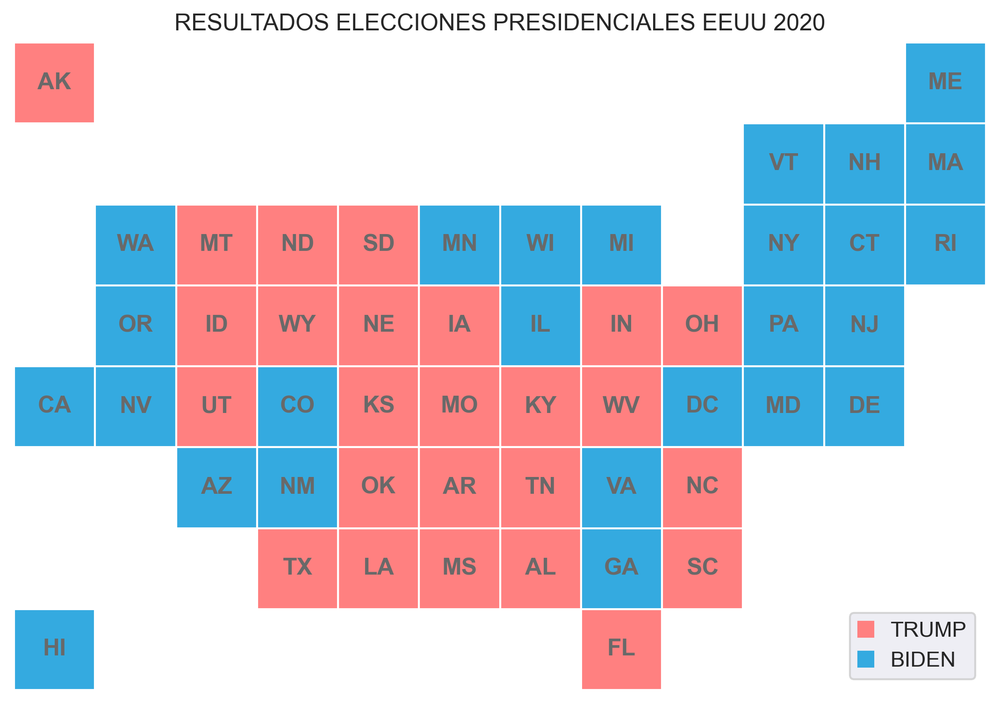

# PEC2: Estudio de técnicas de visualización de datos
## Visualización de Datos
## Master Universitario en Ciencia de Datos
### Alumno: Carlos Luis Gento de Celis

# Índice
1. [Pie Chart](#pie-chart)
2. [Matrix Plot](#matrix-plot)
3. [Tile Grid Map](#tile-grid-map)

## Pie Chart
- **Origen:** Principios del siglo XIX
- **Descripción:** Es un círculo dividido en sectores proporcionales que representan una proporción de un total. Su objetivo es mostrar cómo se dividen los datos en proporciones o porcentajes entre categorías. La suma de proporciones debe ser igual al total de la muestra, y la de porcentajes debe ser igual al 100%.
- **Ejemplos:** Proporciones de hombres y mujeres en una muestra, porcentaje de ventas mensuales de cada producto en una tienda, proporción
- **Tipos de datos:** Numéricos y categóricos. Debe haber al menos una variable categórica.

  
  |                         	| Nivel educativo 	|
  |-------------------------	|-----------------	|
  | Inferior a bachillerato 	| 150             	|
  | Bachillerato            	| 200             	|
  | Estudios Universitarios 	| 500             	|
  
<\center>
 
  
- **Limitaciones:**
   * Cuesta leerlos cuando hay más de cuatro o cinco categorías. A los humanos les cuesta leer ángulos.
   * No es fácil compararlos con otro Pie Charts.
   * No pueden representar evoluciones temporales.
- **Ejemplo de visualización: Cáncer de mama**

Datos utilizados: [Kaggle Adult Income Dataset](https://www.kaggle.com/datasets/wenruliu/adult-income-dataset)

 

  
 

## Matrix Plot

  
 

 
## Tile Grid Map

  
 

